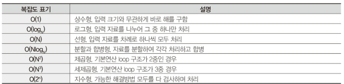

# TOPCIT 정리

## 1. 소프트웨어 개발

### 1. 소프트웨어 공학 개요
01. 소프트웨어 공학의 배경과 목적

가) 소프트웨어 공학
 - 다기능화 및 대규모화 되는 소프트웨어를 성공적으로 개발하기 위해서 요구사항 분석에서 유지보수에 이르기까지 전 과정에 걸쳐 예상되는 어려움을 해결하기 위한 체계적인 관리와 효율적 업무 수행을 지해 주는 기술
 - 체계적인 업무 방식 및 흐름의 정의와 이를 적용할 수 있는 프로세스, 전문적 지식을 갖춘 조직 및 인력의 구성, 정의된 업무 방식과 조직인력이 효율적으로 운영되기 위한 인프라 기술 3가지 핵심 요소를 균형 있고, 조화롭게 유지하기 위한 지속적 노력이 필요

나) 소프트웨어 공학의 4가지 중요요소
 - 방법 
   - 프로젝트 계획 수립과 추정, 시스템과 소프트웨어 분석, 자료구조, 프로그램 구조, 알고리즘, 코딩, 테스팅, 유지관리와 같은 작업들로 구성
   - 특수한 언어 중심 or 그래프 표기법을 도입
   - 소프트웨어 품질에 대한 일련의 평가 기준 도입 
 - 도구
   - 어떤일을 수행할 때 생산성 혹인 일관성을 목적으로 사용하는 방법들을 자동화나 반자동화 시켜놓은 것을 일컬음
   - 소프트웨어 개발 생명주기 상에서 많은 도구가 존재
 - 절차
   - 방법과 도구를 결합, 그것으로 하여금 소프트웨어를 합리적이고 적시에 개발할 수 있도록 함
   - 적용된 방법들, 요구되는 결과물, 품질을 보증하고 변경을 조정하게 도와주는 제어들, 소프트웨어 관리자들이 진행을 평가하게 해주는 마일스톤 등의 순서를 정의함
 - 사람
   - 사람과 조직에 의해 움직이기에 사람에 대한 의존성이 상대적으로 큼 

02. 소프트웨어 개발 생명주기

가) 정의
- 사용자 환경 및 문제점 이해에서 시작하여 운용/유지 보수에 이르기까지의 모든 과정을 의미하며, 일발적인 소프트웨어 생명주기는 [타당성 검토-> 개발 계획 -> 요구사항 분석 -> 설계 -> 구현 -> 테스트 -> 운용 -> 유지보수]의 활동으로 구성

나) 목적
- 프로젝트 비용 산정과 개발 계획 수립, 기본 골격 구성
- 용어의 표준화, 프로젝트 관리

다) 소프트웨어 생명주기 선정
- 기업에서 프로젝트 개발 프로세스를 테일러링하는데 중요한 활동
- 시스템 개발의 리스크와 불확실성 및 이에 대한 이해를 바탕으로 수행
- 선택한 모델은 프로젝트에 존재하는 리스크/불확실성을 최소화시킬 수 있어야 함

라) 소프트웨어 생명주기 모델 종류

1) V모델
- 프로젝트 관리자와 개발자에게 프로젝트 수행 동안 어떤 활동이 수행되어야 하는지 명확하게 보여줌
- 소프트웨어 개발에 대해 잘 알지 못하는 고객을 이해시키는 것이 용이
- 시스템의 요구사항이 모두 식별되고 명확할 때 이상적인 생명주기 모델
- V모델을 적용한 상세 계획은 요구사항이 모두 식별되고 명확해졌을 때 최종적으로 완성
- 특징
 - 프로젝트에 적용, 관리가 용이
 - 개발 활동의 시작/종료 조건 및 프로젝트를 효과적으로 관리할 수 있는 척도 등이 명확하게 정의될 수 있다
 - 프로젝트의 검증 및 확인을 강조하는 모델
    - 요구사항 분석, 설계와 같은 개발활동과 테스트 활동이 어떻게 연관 관계가 있는지를 잘 설명하고 있으며, 전체 개발 주기동안 개발 활동과 이에 해당하는 테스트 활동이 병행되어 진다
 - 테스트 동안 결함이 발견되었을 때, 개발 활동의 어느 단계를 재 수행되어야 하는지 알 수 있다

2) VP모델 (V Model with Prototyping)
- 프로토타이핑은 시스템에 대한 이해 또는 리스크, 불확실성 요소와 같은 이슈를 해결하기 위해 시스템 혹은 일부분을 빠르게 개발하는 방법
- 무엇이 필요하고 무엇이 개발되어야 하는지에 대한 개발자와 고객이 공통적인 이해를 이끌어 낼 수 있다
- V 모델에 프로토타이핑 기법을 추가함으로써 프로젝트의 불확실성 요소나 리스크를 줄일 수 있다
- 프로젝트의 불확실성 요소 혹은 리스크라는 것은 요구사항 단계에서의 요구사항 구현 가능성 여부, 설계 단계에서의 시스템 성능 검증 여부, 새로운 도구의 도입 및 외주 개발 시스템의 위험 요소 등을 포함한다

3) 점증적 모델
- 시스템 개발 시간을 줄일 필요가 있을때 유용한 모델
- 핵심이 되는 부분을 먼저 개발하여 동작 가능하게 만든 후, 나머지 기능을 구현하는 방식
- 몇 번의 기능 확장을 통해 개발된다
- 대부분 요구사항이 정의되어 있지만, 시간이 지남에 따라 개선 여지가 있는 경우에 유용한 모델
- 개발 초기의 외부 인터페이스에 대한 리스크를 줄이는데 유용하게 적용될 수 있다

4) 진화모델
- 시스템 개발 시간을 줄일 필요가 있을 경우 유용한 모델
- 점증적 모델과 달리 전체 시스템에 대한 개발 단계가 여러번 반복되며 각 시스템은 사용자에게 모든 기능을 제공한다
- 하나의 시스템이 개발되어 사용되면서 변경 사항이 도출되고, 변경사항은 다음 시스템 개발에 반영된다
- 변경 사항은 기능에 대한 변경, 사용자 인터페이스에 대한 변경, 신뢰성, 성능향상 등 비기능적 사항에 대한 변경을 포함한다

03. 소프트웨어 개발 방법론
- 개발 단계를 각각 정의하고 단계별 수행활동, 산출물, 검증절차, 산출물 완료 기준을 정의하고 개발 계획, 분석, 설계 및 구현의 수행 단계에 대해 정형화된 방법과 절차, 지원 도구를 정의한다

가) 소프트웨어 개발 방법론의 필요성
- 개발 경험의 축적 및 재활용을 통한 개발 생상성 향상
- 효과적인 프로젝트 관리
- 공식 절차와 산출물을 제시하고 표준용어를 통일하여 의사소통 수단 제공
- 각 단계별 검증과 승인된 종료를 통해 일정 수준의 품질 보증

나) 소프트웨어 개발 방법론 비교

 

 

다) 소프트웨어 개발 
1) 요구사항 분석
- 소프트웨어 개발에 있어 가장 어려운 부분은 무엇을 개발할 것인가를 정확히 결정하는 것
- 소프트웨어 개발의 실제적인 첫 단계로 사용자의 요구에 대하여 이해하는 단계
- 전체 개발 과정에서 개발 비용을 감소시킬 수 있는 결정적인 단계
- 초기에 요구사항을 잘 분석하여 정의하고 관리하기 위해 투자한다면 전체 소프트웨어 개발 기간과 비용의 초과, 품질 저하를 미연에 방지할 수 있음

2) 설계
- 요구분석 과정이 개념적 단계라면, 설계 과정은 물리적 실현의 첫 단계
- 시스템 설계는 서브 시스템들로 이루어지는 시스템 구조를 결정, 서브 시스템들은 하드웨어나 소프트웨어 등의 구성요소에게 할당
- 설계는 품질에 직접적인 영향을 줌 
- 설계가 제대로 되지 않으면 시스템의 안정감 저하 -> 안정감 없는 시스템은 유지보수도 어려움

3) 구현
- 목표는 설계 명세를 기반으로 요구사항을 만족할 수 있도록 프로그래밍 하는 것
- 프로그램은 상세 설계나 사용자 지침서에 기술된 것과 일치하도록 코딩해야 함
- 가장 중요한 작업 중 하나는 코딩 표준을 정하고, 이를 기반으로 명확하게 코드를 작성하는 것

4) 테스팅
- 정해진 요구를 만족하는지, 예상과 실제 결과가 어떤 차이를 보이는지에 대해 수동 or 자동화된 방법을 동원하여 검사하고, 평가하는 일련의 과정을 의미함
- 소프트웨어 품질 보증을 위한 마지막 단계로 품질 확보를 위해 결함을 찾아내는 일련의 작업
- 개발한 소프트웨어 품질에 대한 평가와 품질 향상을 위한 수정 작얿 등이 포함

04. 애자일 개발 방법론

가) 종류
- 스크럼 / 익스트림 프로그래밍(XP) / 린(Lean) 개발방법론 / 애자일 UP

나) 애자일 개발 방법론 - XP
1) XP 개발절차 및 용어

 

- 유저 스토리 : 요구사항 수집, 의사소통 도구를 말하고 기능단위의 필요한 내용을 간단하게 기재
- 스파이크 : 어려움 요구사항 or 잠재 솔루션을 고려한 프로그램, 사용자 스토리의 신뢰성 증대, 기술문제의 위험을 감소하는 목적
- 릴리즈 계획 : 전체 프로젝트에 대한 배포 계획을 수립하여 하나의 반복을 1~3주로 나눠 반복들을 균일하게 유지
- 승인 테스트 : 릴리즈 전 인수 테스트로서 고객이 직접 수행
- 작은 릴리즈 : XP 주기 마지막 단계이고 소규모로 빈번하게 배포하면 고객에게 여러 이득을 조기에 제공

2) XP 가치
- XP에서는 다섯 가지 가치를 제안
  - 의사소통 / 단순성 / 피드백 / 용기 / 존중
3) XP 실천방법

 

다) 스크럼
1) 스크럼 역할자 유형
- 제품 책임자
  - 제품 기능목록에 해당하는 제품 백로그를 만들고 우선순위를 조정하거나 새로운 항목을 추가하는 일 관리
  - 스프린트 계획 수립 시점에는 핵심 역할을 담당하지만 스프린트 시작 후에는 가능한 팀의 운영에 관여하지 않는 것을 권장
- 스크럼 마스터
  - 팀의 업무 방해하는 요소 제거에 노력한다
  - 원칙과 가치를 지키면서 팀이 개발을 진행할 수 있도록 지원
- 스크럼 팀
  - 최소 5명에서 9명으로 구성
  - 사용자 스토리를 사용하여 한 스프린트 동안에 개발할 기능을 도출

2) 스크럼 프로세스
- 스프린트 : 1~4주 단위의 반복개발기간을 가리킨다
- 3가지 미팅 : 일일 스크럼, 스프린트 계획, 스프린트 리뷰
- 3가지 산출물 : 제품 백로그, 스프린트 백로그, 소멸차트
  - 제품 백로그 : 제품을 담고자 하는 기능의 우선순위 목록, 고객을 대표하여 제품 책임자가 주로 우선순위를 결정
    - 제품 백로그에 정의된 기능을 사용자 스토리라한다
    - 사용자 업무량에 대한 추정은 주로 스토리 포인트라는 기준을 이용
  - 스프린트 백로그 : 하나의 스프린트 동안 개발할 목록
    - 사용자 스토리와 이를 완료하기 위한 작업을 과업으로 정의
    - 과업의 크기는 시간 단위로 추정
  - 소멸 차트 : 개발을 완료하기까지 남은 작업량을 보여주는 그래프
    - 각 이터레이션 별로 남아있는 작업량을 스토리포인트라는 것으로 나타낸 것

- 3가지 미팅
  - 스프린트 계획
    - 각 스프린트에 대한 목표를 세우고 제품 백로그로부터 스프린트에서 진행할 항목을 선택
    - 각 항목에 대한 담당자를 배정하고 태스크 단위로 계획을 수립
  - 일일 스크럼
    - 매일 15분 간 프로젝트 진행사황을 공유하는 회의
    - 모든 팀원이 참석해 매일 각자 한 일, 할 일, 문제점 등을 이야기함
  - 스프린트 리뷰
    - 스프린트 목표를 달성했는지 작업 진행과 결과물을 확인하는 회의
    - 스크럼 팀은 스프린트 동안 작업한 결과를 참석자들에게 데모하고 피드백을 받는다
    - 스프린트 동안 진행된 모든 작업에 대한 데모를 진행하고 고객이 참여하는 것이 좋음
    - 스크럼 마스터는 스프린트 동안 잘된 점, 아쉬웠던 점, 개선할 사항 등을 찾기 위한 회고를 진행할 수 있다
3) 스크럼 특징
- 투명성 : 프로젝트가 현재 어떤 상태인지 계획대로 진행되고 있는지 어떤 문제점을 가지고 있는지 정확히 파악하는 건 어려운 일
  - 스크럼은 스크럼 회의, 소멸차트, 스프린트 리뷰와 같은 기법을 이용해 프로젝트 상태나 문제점을 효과적으로 파악할 수 있다
- 타임박싱 : 스크럼을 진행하는데 들어가는 시간을 제한함으로써 프로젝트 진행에만 집중하는 것이 가능
  - 일일 스크럼은 매일 15분의 제한된 시간에 진행, 스프린트 리뷰는 매 이터레이션 마다 주기적으로 진행
- 커뮤니케이션 : 스크럼에서는 팀원 간 커뮤니케이션을 원활하게 하기 위해 많은 노력을 기울임
  - 개발자들이 갖고 있는 문제점을 공유하고, 플래닝 포커를 사용하여 사용자 스토리의 구현 난이도, 시간을 토론하는 절차는 팀원 간 커뮤니케이션을 원활하게 해주는 스크럼의 특징 중 하나
- 경험주의 모델 : 고유 프로세스 모델을 가지고 있지만 많은 기법들이 프로젝트에 참여하고 있는 개인의 경험을 중요시
  - 프로젝트별 고유한 상황과 특징을 가지고 있기에 기존 정형화된 프로세스로는 이런 프로젝트 상황을 따라가기 어렵다
 
### 2. 소프트웨어 재사용
01. 소프트웨어 재사용

가) 소프트웨어 재사용 개요
- 소프트웨어 재사용은 기존 소프트웨어 또는 소프트웨어 지식을 활용해, 새로운 소프트웨어를 구축하는 일
- 재사용가능한 소프트웨어나 소프트웨어 지식은 재상용가능한 자산

- 정의
  - 사용 소프트웨어 개발관련 지식을 표준화하여 개발 생산성을 높이기 위해 반복적으로 사용하기 적합하도록 구성하는 방법
  - 기존 개발 기능, 성능 및 품질을 인정받았던 소프트웨어의 전체 or 일부분을 다시 사용하여 신규 개발되는 소프트웨어의 품질과 생산성 및 신뢰성을 높이고 개발 일정 및 비용을 감소시켜 주는 대응방안
  - 기존 개발 모듈이나 프로그램, 산출물 등을 동일한 으용 분야, 서로 다른 업무 or 서로 다른 기업 간에 다시 사용하거나 일부 수정 후 재사용할 수 있는 개념
- 목적
  - 신뢰성 / 확장성 / 생산성

나) 소프트웨어 재사용의 대상
- 일반적 지식(환경 정보, 외부 지식) / 설계 정보(기본설계, 상세설계) / 데이터 정보 / 프로그램 코드(모듈, 프로그램) / 기타

다) 소프트웨어 재사용의 원칙
- 범용성 : 특정 응용분야만이 아닌 일반적으로 활용될 수 있는 정도
- 모듈성 : 정보은닉과 추상화의 원칙으로 최소한의 결합도 및 최대한의 응집력을 갖도록 하는 특성
- 하드웨어 독립성 : 가능한 실행 하드웨어 기종과 무관해야 함
- 소프트웨어 독립성 : OS, DBMS와 무관하게 운영해야 함
- 일반성 : 많은 개발자들에게 공통적으로 필요하고 사용 가능해야한다
- 신뢰성 : 품질을 믿고 사용할 수 있어야 한다

라) 실무에서 재사용 구현의 문제점
- 고통으로 사용할 수 있는 소프트웨어 모듈을 발견하기 어려움
- 소프트웨어 표준화가 부족
- 소프트웨어 모듈의 내부 인터페이스 요구사항의 이해가 곤란하다
- 변경으로 인한 부차적 영향으로 이해가 곤란하다
- 재사용을 위한 소프트웨어 부품은 개발비가 더 들 수 있다
- 재사용의 효익은 오랜 시간이 경과 후 나타난다
- 현존하는 소프트웨어 부품에서 재사용 부품의 추출이 비현실적이다

마) 재사용 효과
- 소프트웨어 생산의 TCO 절감
- 높은 품질의 소프트웨어 생산을 위한 공유 및 활용효과
- 시스템 개발에 대한 정보공유 및 타 프로젝트의 산출물 공유
- 시스템 구조와 좋은 시스템 구축방법에 대한 교육적 효과

02. 역공학

가) 역공학 정의
- 소프트웨어 공학의 한 분야로 이미 만들어진 시스템을 역으로 추적해 처음의 문서나 설계기법 등의 자료를 얻어 내는 일
- 시스템을 이해하여 수정하는 소프트웨어 유지보수 단계에 수행하는 일련의 활동
- Input : 원시코드, 목적코드, 작업절차, 라이브러리 등 입출력 형태의 자료나 문서
- Output : 구조도, 자료 흐름도, 제어 흐름 그래프, 개체 관계도

나) 역공학 장점
- 상용화되거나 기 개발된 소프트웨어 분석을 도와줌
- 기존 시스템의 자료와 정보를 설계 수준에서 분석할 수 있어 유지 보수성을 향상
- 기존 시스템 정보를 Repository에 보관하여 CASE의 사용을 용이하게 함

다) 역공학이 필요한 경우
- 기 가동중인 시스템의 유지보수가 어려운 경우
- 변경이 빈번해 시스템 효율이 저하된 경우
- 파일 시스템으로 개발된 업무를 관계형 데이트베이스로 재구축 하려는 경우
- 기본 메인 프레임을 다운사이징하는 경우

라) 역공학 종류
- 논리 역공학 : 원시코드로부터 정보를 추출하여 물리적 설계 정보저장소에 저장, 물리적 설계정보를 얻어내는 역할 수행
- 자료 역공학 : 기존 데이터베이스를 수정하거나 새로운 데이터베이스 관리시스템으로 전이하는 역할 수행

### 3. 자료구조와 알고리즘
01. 자료구조

가) 정의
- 자료를 컴퓨터 기억장치 내에 저장하는 방법, 다용한 자료를 효율적으로 표현하고 활용할 수 있도록 자료의 특성과 사용 용도를 고려하여 조직적, 체계적으로 정의한 것

나) 분류
- 선형구조 : 자료가 일렬로 연결되어 있는 형태로 구성하는 방법
  - 원시코드로부터 정보를 추출해 물리적 설꼐 정보저장소에 저장
  - 물리적 설계자료들이 직선 형태로 나열되어 자료들 간의 순서를 고려한 구조로 전후/인접/선후 자료들 간 1:1  관계로 나열
  - 배열, 리스트(선형리스트, 연결리스트), 스택, 큐, 데크 등
  - 정보를 얻어내는 역할 수행
- 비선형구조 : 자료의 구성이 계층구조나 망구조의 특별한 형태를 띠는 구조
  - 한 자료 뒤 여러 개의 자료들이 존재하는 구조, 인접/전후 자료들 간 1:다 or 다:다 관계로 배치
  - 트리, 그래프 등이 있음

- 순차자료구조
  - 메모리 저장 방식 : 메로리저장 시작위치부터 빈자리 없이 자료를 순서대로 연속적으로 저장하는 방식
  - 논리/물리 순서 일치 여부 : 논리적 순서와 물리적 순서가 일치하는 방식
  - 연산특징 : 삽입, 삭제 연산을 해도 빈자리가 없기 때문에 자료가 순서대로 연속하여 저장
  - 프로그램 기법 : 배열을 이용한 구현
- 연결자료구조
  - 메모리 저장 방식 : 메모리에 저장된 물리적 위치나 순서에 상관없이 링크에 의해 논리적인 순서를 표현하는 방식
  - 논리/물리 순서 일치 여부 : 논리적 순서와 물리적 순서가 일치하지 않음
  - 연산 특징 : 삽입, 삭제 연산으로 논리적 순서가 변경되어도 링크정보만 변경되어 물리적 순서는 변경되지 않음
  - 프로그램 기법 : 포인터를 이용한 구현

다) 스택과 큐
- 스택 (LIFO)
  - 선형리스트의 하나로 데이터가 입력된 순서로 기억공간에 저장되어 출력 시 가장 나중에 쌓인 데이터가 가장 먼저 출력하게 된 자료구조
  - top으로 정한 곳에서만 접근 가능하여 top 위치에서만 원소를 삽입하고 마지막에 삽입한 원소는 맨 위에 쌓였다가 가장 먼저 출력

  - 

  - top() : 스택의 맨위에 있는 데이터 값을 반환
  - push() : 스택에 데이터를 삽입
  - pop() : 스택에서 데이터를 삭제하여 반환
  - isempty() : 스택에 원소가 없으면 true 반환, 있으면 false 반환
  - isfull() : 스택에 원소가 없으면 false, 있으면 true

- 큐
  - 데이터가 삽입되는 곳과 삭제되는 곳이 다른 자료구조, 뒤에서만 삽입되고 앞에서는 삭제만 할 수 있는 구조

  - 

  - enQueue : 큐에 데이터를 삽입, rear를 움직여 큐의 공간을 확보한 후 데이터를 삽입
  - deQueue : 큐에서 데이터를 삭제, front를 움직여 가장 오래된 데이터를 다음 번째 데이터로 넘기게 된다

라) 트리와 그래프
- 트리
  - 원소들 간에 계층관계를 가지는 계층형 자료구조로 상위원소에서 하위 원소로 내려가면서  확장되는 나무 모양의 구조를 가지고 있으며 원소들 간에 1:다 관계를 가짐
  - 트리의 시작노드를 루트노드, 노드를 연결하는 선을 간선
  - 같은 부모 노드를 가진 자식 노드들을 형제노드, 부모노드와 연결된 간선을 끊었을 때 생성되는 트리를 서브트리
- 그래프
  - 연결되어 있는 원소 사이의 다:다 관계를 표현하는 자료구조로 객체를 나타내는 정점과 객체를 연결하는 간선의 집합

  - 

  - 수행하는 기능이나 응용 방법에 따라 다양한 구현방법으로 메모리 내 표현
    - 인접행렬 : 순차 자료구조를 이용한 그래프 구현 방식으로 행렬에 대한 2차원 배열을 사용하여 그래프의 두 정점을 연결한 간선의 유무를 행렬로 저장하는 방식
    - 인접리스트 : 연결 자료구조를 이용한 그래프 구현방식으로 각 정점에 대한 인접 정점들을 연결하여 만든 단순 연결 리스트로 각 정점의 차수만큼 노드를 연결하는 방식

마) 자료구조의 선택 기준
- 자료의 처리 시간 / 자료의 크기 / 자료의 활용 빈도 / 자료의 갱신 정도 / 프로그램의 용이성

바) 자료구조의 활용
- 리스트 : 배열의 구현, DBMS 인덱스, 탐색이나 정렬과 같은 문제 등
- 스택 : 인터럽트 처리, 재귀 프로그램의 순서 제어, 서브루틴의 복귀 번지 저장, 후위 표기법으로 표현된 수식의 연산, 텍스트 에디터 Undo 기능 등
- 큐 : 운영체제 작업 스케줄링, 대기 행렬의 처리, 비동기 데이터 교환, 키보드 버퍼 이용, 스풀 운용 등
- 데크 : 스텍과 큐의 장점만 활용한 자료구조
- 트리 : 탐색이나 정렬과 같은 문제, 문법의 파싱, 허프만 코드, 결정 트리, 게임 등
- 그래프 : 컴퓨터 네트워크, 전기회로 분석, 이항 관계, 연립 방정식 등

02. 알고리즘

가) 알고리즘
- 주어진 문제를 해결하기 위한 일련의 처리 절차를 단계적으로 기술한 것으로 문제 해결 방법을 추상화하여 단계적 절차를 논리적으로 기술해 놓은 명세서
- 조건 : 입력 / 출력 / 명확성 / 유한성 / 효과성

나) 알고리즘 분석 기준
- 정확성 : 알고리즘이 타당한 입력에 대해서 유한 시간 내에 올바른 결과를 산출하는가 판단
- 작업량 : 알고리즘을 수행하는데 걸리는 수행 횟수를 나타내며, 전체 알고리즘에서 기본으로 포함되는 일반 연산을 제외하고 흐름의 핵심이 되는 중요한 연산들만으로 작업량 측정
- 기억 장소 사용량 : 알고리즘이 수행되는 동안 데이터와 정보 등을 저장하기 위해 필요한 컴퓨터 메모리의 사용량을 의미
- 최적성 : "어떤 알고리즘이 최적이다"라고 하는 것은 알고리즘을 적용할 시스템의 사용환경을 고려 할때 그 알고리즘보다 더 적합한 알고리즘이 없다는 것을 의미
- 단순성 : 알고리즘의 표현이 얼마나 이해하기 쉽게 명확하게 작성되었는지를 의미, 단순하면 알고리즘의 정확성을 증명하는 것과 프로그램의 작성 및 디버깅이 수월하다

다) 알고리즘 성능 분석
- 실행에 필요한 공간 측면에서 분석하는 공간 복잡도와 실행에 소요되는 시간 측면에서 분석하는 시간 복잡도를 추정하여 일반적인 평가를 한다
- 공간 복잡도 = 고정 공간량 + 가변 공간량
  - 고정 공간량 : 프로그램, 변수 및 상수들과 같이 프로그램의 크기나 입출력 횟수에 상관없이 고정적으로 필요한 저장 공간
  - 가변 공간량 : 프로그램의 수행과정에서 사용하는 자료와 변수들을 저장하는 공간과 함수 실행에 관련된 정보를 저장하는 공간
- 시간 복잡도 = 컴파일시간 + 실행시간
  - 컴파일시간 : 프로그램 특성과 관련이 적은 고정적 시간으로 일단 컴파일 되면 프로그램의 수정이 일어나지 않는 한 일정하게 유지
  - 실행시간 : 프로그램의 실행시간으로 컴퓨터의 성능 등에 의존하므로 실제 정확한 실행시간을 측정하기 보다는 명령문의 실행 빈도수를 구하여 계산
- 알고리즘 복잡도

  - 

라) 정렬 알고리즘
- 내부정렬 : 소량의 데이터에 대해 주기억 장치에 올려서 정렬하는 방식으로 정렬 속도는 빠르나 주기억 장치의 용량에 의해 정렬할 수 있는 데이터의 양이 제한됨
- 외부정렬 : 대량의 데이터에 대해 보조 기억 장치에서 정렬하는 방식으로 대량의 데이터를 몇 개의 서브 파일로 나누어 내부 정렬을 한 후 보조기억장치에서 정렬된 각 서브 파일들을 병합하는 방식으로 속도가 느림
- 내부 정렬 알고리즘의 분류
  - 삽입법 : 삽입정렬, 쉘정렬
  - 교환법 : 선택정렬, 퀵정렬, 버블정렬
  - 선택법 : 힙정렬
  - 병합법 : 머지정렬
  - 분배법 : 계수정렬, 기수정렬, 버킷정렬
- 내부 정렬 알고리즘의 수행시간 비교

  - 

  - 선택정렬은 A[1---n]에서 가장 큰 원소를 찾아 배열의 맨 끝자리에 있는 A[n] 자리를 바꾸는 정렬 방법
  - 버블정렬은 선택정렬처럼 제일 큰 원소를 끝자리로 옮기는 작업을 반복하지만 제일 큰 원소를 오른쪽으로 옮길 때 왼쪽에 이웃한 수를 비교하면서 순서가 제대로 되어 있지 않으면 자리를 바꾸어 진행하는 정렬 알고리즘

마) 검색 알고리즘
- 데이터 집합에서 원하는 항목을 효율적으로 찾는 기법으로 데이터 정렬여부에 따라 순차검색과 제어검색으로 구분
- 특정 함수에 따라 키 값을 계산하여 데이터를 검색하는 해싱도 있다
- 자료구조 형태, 배열 상태를 고려하여 최적의 탐색 방법을 선택해야 한다

- 검색 알고리즘 분류
  
  - 
  
  - 

바) 그래프 탐색 알고리즘
- 그래프 탐색
  - 하나의 정점에서 시작하여 그래프에 있는 모든 정점을 한 번씩 방문하여 처리하는 연산
- 깊이 우선 탐색(DFS)
  - 시작 정점의 한 방향으로 갈 수 있는 경로가 있는데까지 깊이 탐색해가다 더 이상 갈 곳이 없을면 마지막 갈림길 간선이 있는 정점으로 되돌아와 다른 방향의 간선으로 탐색을 계속 반복하여 목표 노드를 찾을 때까지 정점을 방문하는 방법
  - 후입선출 구조의 스택을 사용
  - 현재 경로상의 노드들만 기억하기에 저장 공간의 수요가 적고 목표노드가 깊은 단계에 있는 경우 신속하게 목표를 찾을 수 있고 구현이 용이
- 너비 우선 탐색(BFS)
  - 하나의 시작 정점을 방문한 후 인접한 노드를 먼저 탐색하는 방법
  - 시작 정점으로부터 가까운 정점을 먼저 방문하고 멀리 떨어져 있는 정점을 나중에 방문하는 탐색 방법
  - 어떤 노드를 방문했었는지 여부를 반드시 검사해야 하고 방문한 노드들을 차례대로 꺼낼 수 있는 자료 구조인 큐를 사용

- 

- 

사) 최소 신장 트리
- 신장트리는 무뱡향 가중치 그래프 내 모든 정점을 포함하고 서로 연결되어 있는 트리의 특수한 형태로 사이클을 포함해서 안되는 트리
- 신장트리는 구성하는 가중치의 합이 최소인 신장 트리를 최소 신장 트리라 한다
- 크루스칼 알고리즘
  - 정점에 연결된 간선 가운데 가중치가 최소인 간선을 선택하고 추가된 간선이 사이클을 만드는지 체크하는 방식으로 처리
  - 가중치가 가장 낮은 간선을 선택한 후 정점과 연결이 되어 있지 않더라도 가중치가 작은 간선ㅇ르 순서대로 선택하는 방법
- 프림 알고리즘
  -  분석대상 그래프에서 임의의 한 정점을 선택하여 각 반복과정마다 그때까지 구성된 최소 신장 트리 부분에 방문하지 않은 새로운 정점과 간선을 선택하여 확장해나가는 방법

### 4. 소프트웨어 설계 원리와 구조적 설계
01. 소프트웨어 설계 원리
- 사용자의 요구사항을 지속적으로 분할하여 문제영역의 복잡성을 줄어나가야 하며, 이를 통해 얻어진 결과는 역할단위의 독립성과 의존성을 고려하여 적절한 그룹으로 재조합되어야 한다
- 상위레벨에서 분할한 시스템 구성 요소를 서브시스템이라 부르며, 독립적으로 기능을 수행할 수 있고 컴파일 될 수 있는 프로그램 구성요소를 일컬음

가) 추상화
- 큰 흐름을 잃지 않으며 점차적으로 문제영역에 접근하기 위해 상세한 수준의 구현을 고민하기 보다 상위 수준에서 제품의 구현을 먼저 생각하는 것을 의미
- 엔지니어링 전 과정에서 이루어지는 중요한 원리이며, 엔지니어링이란 추상화가 높은 단계에서 낮은 단계로 이동되는 과정
- 추상화 유형은 자료 추상화, 제어 추상화, 과정 추상화로 나눌 수 있다
- 시스템을 분할하며 컴포넌트가 어떻게 서로 상호 작용하는지, 외부에 나타나는 동작을 아는 것은 컴포넌트 내부의 상세한 구현 방법을 아는 것에 우선한다
- 컴포넌트의 구현 방법을 과감히 생략하고 외부 인터페이스에 초점을 맞추는 것이 추상화 개념

나) 정보 은닉
- 각 모듈의 내부 내용을 감추고 인터페이스를 통해서만 메시지를 전달할 수 있도록 하는 개념
- 내부 정보 접근을 제한하여 한 모듈 또는 하부 시스템이 다른 모듈의 구현에 영향을 받지 않게 설계되는 것을 의미
- 모듈이 외부와 인터페이스에 의해 정의되며, 모듈의 내부 구조나 진행 과정을 포함하는 상세 정보는 타 모듈에 감추어져 있다면 정보가 은닉되어 있는 것
- 정보 은닉은 모듈들 사이의 독립성을 유지시켜 주는 것
- 구성 요소 간의 독립성을 유지시켜준다는 점이 중요, 모듈 서로 간의 내부 구조를 감추어 주고 서로의 내부 구조를 알 필요가 없이 오직 정해진 인터페이스로만 서로 소통한다

다) 단계적 정제
- 프로그램의 구조에서 점차 모듈에 대한 세부 사항으로 내려가며 구체화된다
- 정제 과정에서 추상화 수준은 낮아지며 각 기능은 분해되어 해결방안을 제시하게 된다
- 설계는 높은 추상화 단계에서 낮은 추상화 단계로 가는 단계적 정제 과정이며, 문제기술에서 요구사항 분석, 설계, 프로그래밍으로 이어지는 엔지니어링의 흐름도 단계적 정제 과정이라 볼 수 있다

라) 모듈화
- 프로그래밍 언어로 표현하면 서브루틴, 프로시저, 함수 등으로 부른다
- 하향식 접근 방법을 사용하여 기능 단위로 쪼개어 나가는 것이 일반적, 모듈들 사이의 제어 계층이 나타나게 된다
- 시스템을 지능적으로 관리할 수 있도록 해 주며, 복잡도의 문제를 해결해준다
- 크고 복잡한 문제를 해결하기 위해 문제를 작은 단위인 모듈로 분할하여 정복하게 된다
- 시스템의 유지보수와 수정을 용이하게 해준다
- 모듈 수가 증가하면 상대적으로 각 모듈의 크기는 감소하며 모듈들 사이 상호교류가 증가하여 시스템 성능이 떨어지고 과부하 현상이 나타나게 된다

마) 구조화
- 분할 과정에 의해 얻어질 수 있으며, 분할하여 정복하는 개념과 연고나되어 있다

02. 응집도와 결합도
- 기능적 독립성을 극대화하고 모듈들 사이의 결합을 줄이는 것이 유지보수를 쉽게 할 수 있는 우수한 설계의 원칙이라 할 수 있다
가) 응집도
