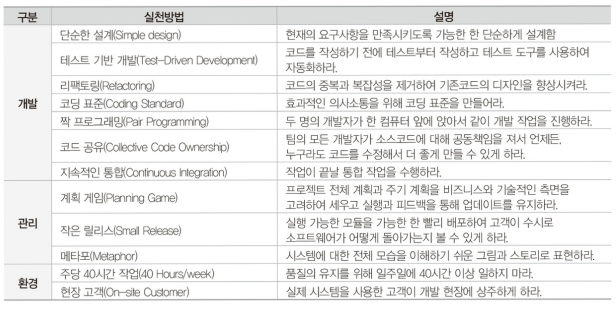

# TOPCIT 정리

### 1. 소프트웨어 개발

1. 소프트웨어 공학 개요
01. 소프트웨어 공학의 배경과 목적

가) 소프트웨어 공학
 - 다기능화 및 대규모화 되는 소프트웨어를 성공적으로 개발하기 위해서 요구사항 분석에서 유지보수에 이르기까지 전 과정에 걸쳐 예상되는 어려움을 해결하기 위한 체계적인 관리와 효율적 업무 수행을 지우너해 주는 기술
 - 체계적인 업무 방식 및 흐름의 정의와 이를 적용할 수 있는 프로세스, 전문적 지식을 갖춘 조직 및 인력의 구성, 정의된 업무 방식과 조직인력이 효율적으로 운영되기 위한 인프라 기술 3가지 핵심 요소를 균형 있고, 조화롭게 유지하기 위한 지속적 노력이 필요

나) 소프트웨어 공학의 4가지 중요요소
 - 방법 
   - 프로젝트 계획 수립과 추정, 시스템과 소프트웨어 분석, 자료구조, 프로그램 구조, 알고리즘, 코딩, 테스팅, 유지관리와 같은 작업들로 구성
   - 특수한 언어 중심 or 그래프 표기법을 도입
   - 소프트웨어 품질에 대한 일련의 평가 기준 도입 
 - 도구
   - 어떤일을 수행할 때 생산성 혹인 일관성을 목적으로 사용하는 방법들을 자동화나 반자동화 시켜놓은 것을 일컬음
   - 소프트웨어 개발 생명주기 상에서 많은 도구가 존재
 - 절차
   - 방법과 도구를 결합, 그것으로 하여금 소프트웨어를 합리적이고 적시에 개발할 수 있도록 함
   - 적용된 방법들, 요구되는 결과물, 품질을 보증하고 변경을 조정하게 도와주는 제어들, 소프트웨어 관리자들이 진행을 평가하게 해주는 마일스톤 등의 순서를 정의함
 - 사람
   - 사람과 조직에 의해 움직이기에 사람에 대한 의존성이 상대적으로 큼 

02. 소프트웨어 개발 생명주기

가) 정의
- 사용자 환경 및 문제점 이해에서 시작하여 운용/유지 보수에 이르기까지의 모든 과정을 의미하며, 일발적인 소프트웨어 생명주기는 [타당성 검토-> 개발 계획 -> 요구사항 분석 -> 설계 -> 구현 -> 테스트 -> 운용 -> 유지보수]의 활동으로 구성

나) 목적
- 프로젝트 비용 산정과 개발 계획 수립, 기본 골격 구성
- 용어의 표준화, 프로젝트 관리

다) 소프트웨어 생명주기 선정
- 기업에서 프로젝트 개발 프로세스를 테일러링하는데 중요한 활동
- 시스템 개발의 리스크와 불확실성 및 이에 대한 이해를 바탕으로 수행
- 선택한 모델은 프로젝트에 존재하는 리스크/불확실성을 최소화시킬 수 있어야 함

라) 소프트웨어 생명주기 모델 종류

1) V모델
- 프로젝트 관리자와 개발자에게 프로젝트 수행 동안 어떤 활동이 수행되어야 하는지 명확하게 보여줌
- 소프트웨어 개발에 대해 잘 알지 못하는 고객을 이해시키는 것이 용이
- 시스템의 요구사항이 모두 식별되고 명확할 때 이상적인 생명주기 모델
- V모델을 적용한 상세 계획은 요구사항이 모두 식별되고 명확해졌을 때 최종적으로 완성
- 특징
 - 프로젝트에 적용, 관리가 용이
 - 개발 활동의 시작/종료 조건 및 프로젝트를 효과적으로 관리할 수 있는 척도 등이 명확하게 정의될 수 있다
 - 프로젝트의 검증 및 확인을 강조하는 모델
    - 요구사항 분석, 설계와 같은 개발활동과 테스트 활동이 어떻게 연관 관계가 있는지를 잘 설명하고 있으며, 전체 개발 주기동안 개발 활동과 이에 해당하는 테스트 활동이 병행되어 진다
 - 테스트 동안 결함이 발견되었을 때, 개발 활동의 어느 단계를 재 수행되어야 하는지 알 수 있다

2) VP모델 (V Model with Prototyping)
- 프로토타이핑은 시스템에 대한 이해 또는 리스크, 불확실성 요소와 같은 이슈를 해결하기 위해 시스템 혹은 일부분을 빠르게 개발하는 방법
- 무엇이 필요하고 무엇이 개발되어야 하는지에 대한 개발자와 고객이 공통적인 이해를 이끌어 낼 수 있다
- V 모델에 프로토타이핑 기법을 추가함으로써 프로젝트의 불확실성 요소나 리스크를 줄일 수 있다
- 프로젝트의 불확실성 요소 혹은 리스크라는 것은 요구사항 단계에서의 요구사항 구현 가능성 여부, 설계 단계에서의 시스템 성능 검증 여부, 새로운 도구의 도입 및 외주 개발 시스템의 위험 요소 등을 포함한다

3) 점증적 모델
- 시스템 개발 시간을 줄일 필요가 있을때 유용한 모델
- 핵심이 되는 부분을 먼저 개발하여 동작 가능하게 만든 후, 나머지 기능을 구현하는 방식
- 몇 번의 기능 확장을 통해 개발된다
- 대부분 요구사항이 정의되어 있지만, 시간이 지남에 따라 개선 여지가 있는 경우에 유용한 모델
- 개발 초기의 외부 인터페이스에 대한 리스크를 줄이는데 유용하게 적용될 수 있다

4) 진화모델
- 시스템 개발 시간을 줄일 필요가 있을 경우 유용한 모델
- 점증적 모델과 달리 전체 시스템에 대한 개발 단계가 여러번 반복되며 각 시스템은 사용자에게 모든 기능을 제공한다
- 하나의 시스템이 개발되어 사용되면서 변경 사항이 도출되고, 변경사항은 다음 시스템 개발에 반영된다
- 변경 사항은 기능에 대한 변경, 사용자 인터페이스에 대한 변경, 신뢰성, 성능향상 등 비기능적 사항에 대한 변경을 포함한다

03. 소프트웨어 개발 방법론
- 개발 단계를 각각 정의하고 단계별 수행활동, 산출물, 검증절차, 산출물 완료 기준을 정의하고 개발 계획, 분석, 설계 및 구현의 수행 단계에 대해 정형화된 방법과 절차, 지원 도구를 정의한다

가) 소프트웨어 개발 방법론의 필요성
- 개발 경험의 축적 및 재활용을 통한 개발 생상성 향상
- 효과적인 프로젝트 관리
- 공식 절차와 산출물을 제시하고 표준용어를 통일하여 의사소통 수단 제공
- 각 단계별 검증과 승인된 종료를 통해 일정 수준의 품질 보증

나) 소프트웨어 개발 방법론 비교

 

 

다) 소프트웨어 개발 
1) 요구사항 분석
- 소프트웨어 개발에 있어 가장 어려운 부분은 무엇을 개발할 것인가를 정확히 결정하는 것
- 소프트웨어 개발의 실제적인 첫 단계로 사용자의 요구에 대하여 이해하는 단계
- 전체 개발 과정에서 개발 비용을 감소시킬 수 있는 결정적인 단계
- 초기에 요구사항을 잘 분석하여 정의하고 관리하기 위해 투자한다면 전체 소프트웨어 개발 기간과 비용의 초과, 품질 저하를 미연에 방지할 수 있음

2) 설계
- 요구분석 과정이 개념적 단계라면, 설계 과정은 물리적 실현의 첫 단계
- 시스템 설계는 서브 시스템들로 이루어지는 시스템 구조를 결정, 서브 시스템들은 하드웨어나 소프트웨어 등의 구성요소에게 할당
- 설계는 품질에 직접적인 영향을 줌 
- 설계가 제대로 되지 않으면 시스템의 안정감 저하 -> 안정감 없는 시스템은 유지보수도 어려움

3) 구현
- 목표는 설계 명세를 기반으로 요구사항을 만족할 수 있도록 프로그래밍 하는 것
- 프로그램은 상세 설계나 사용자 지침서에 기술된 것과 일치하도록 코딩해야 함
- 가장 중요한 작업 중 하나는 코딩 표준을 정하고, 이를 기반으로 명확하게 코드를 작성하는 것

4) 테스팅
- 정해진 요구를 만족하는지, 예상과 실제 결과가 어떤 차이를 보이는지에 대해 수동 or 자동화된 방법을 동원하여 검사하고, 평가하는 일련의 과정을 의미함
- 소프트웨어 품질 보증을 위한 마지막 단계로 품질 확보를 위해 결함을 찾아내는 일련의 작업
- 개발한 소프트웨어 품질에 대한 평가와 품질 향상을 위한 수정 작얿 등이 포함

04. 애자일 개발 방법론

가) 종류
- 스크럼 / 익스트림 프로그래밍(XP) / 린(Lean) 개발방법론 / 애자일 UP

나) 애자일 개발 방법론 - XP
1) XP 개발절차 및 용어

 

- 유저 스토리 : 요구사항 수집, 의사소통 도구를 말하고 기능단위의 필요한 내용을 간단하게 기재
- 스파이크 : 어려움 요구사항 or 잠재 솔루션을 고려한 프로그램, 사용자 스토리의 신뢰성 증대, 기술문제의 위험을 감소하는 목적
- 릴리즈 계획 : 전체 프로젝트에 대한 배포 계획을 수립하여 하나의 반복을 1~3주로 나눠 반복들을 균일하게 유지
- 승인 테스트 : 릴리즈 전 인수 테스트로서 고객이 직접 수행
- 작은 릴리즈 : XP 주기 마지막 단계이고 소규모로 빈번하게 배포하면 고객에게 여러 이득을 조기에 제공

2) XP 가치
- XP에서는 다섯 가지 가치를 제안
  - 의사소통 / 단순성 / 피드백 / 용기 / 존중
3) XP 실천방법

 

다) 스크럼
1) 스크럼 역할자 유형
- 제품 책임자
  - 제품 기능목록에 해당하는 제품 백로그를 만들고 우선순위를 조정하거나 새로운 항목을 추가하는 일 관리
  - 스프린트 계획 수립 시점에는 핵심 역할을 담당하지만 스프린트 시작 후에는 가능한 팀의 운영에 관여하지 않는 것을 권장
- 스크럼 마스터
  - 팀의 업무 방해하는 요소 제거에 노력한다
  - 원칙과 가치를 지키면서 팀이 개발을 진행할 수 있도록 지원
- 스크럼 팀
  - 최소 5명에서 9명으로 구성
  - 사용자 스토리를 사용하여 한 스프린트 동안에 개발할 기능을 도출

2) 스크럼 프로세스
- 스프린트 : 1~4주 단위의 반복개발기간을 가리킨다
- 3가지 미팅 : 일일 스크럼, 스프린트 계획, 스프린트 리뷰
- 3가지 산출물 : 제품 백로그, 스프린트 백로그, 소멸차트
  - 제품 백로그 : 제품을 담고자 하는 기능의 우선순위 목록, 고객을 대표하여 제품 책임자가 주로 우선순위를 결정
    - 제품 백로그에 정의된 기능을 사용자 스토리라한다
    - 사용자 업무량에 대한 추정은 주로 스토리 포인트라는 기준을 이용
  - 스프린트 백로그 : 하나의 스프린트 동안 개발할 목록
    - 사용자 스토리와 이를 완료하기 위한 작업을 과업으로 정의
    - 과업의 크기는 시간 단위로 추정
  - 소멸 차트 : 개발을 완료하기까지 남은 작업량을 보여주는 그래프
    - 각 이터레이션 별로 남아있는 작업량을 스토리포인트라는 것으로 나타낸 것

- 3가지 미팅
  - 스프린트 계획
    - 각 스프린트에 대한 목표를 세우고 제품 백로그로부터 스프린트에서 진행할 항목을 선택
    - 각 항목에 대한 담당자를 배정하고 태스크 단위로 계획을 수립
  - 일일 스크럼
    - 매일 15분 간 프로젝트 진행사황을 공유하는 회의
    - 모든 팀원이 참석해 매일 각자 한 일, 할 일, 문제점 등을 이야기함
  - 스프린트 리뷰
    - 스프린트 목표를 달성했는지 작업 진행과 결과물을 확인하는 회의
    - 스크럼 팀은 스프린트 동안 작업한 결과를 참석자들에게 데모하고 피드백을 받는다
    - 스프린트 동안 진행된 모든 작업에 대한 데모를 진행하고 고객이 참여하는 것이 좋음
    - 스크럼 마스터는 스프린트 동안 잘된 점, 아쉬웠던 점, 개선할 사항 등을 찾기 위한 회고를 진행할 수 있다
3) 스크럼 특징
- 투명성 : 프로젝트가 현재 어떤 상태인지 계획대로 진행되고 있는지 어떤 문제점을 가지고 있는지 정확히 파악하는 건 어려운 일
  - 스크럼은 스크럼 회의, 소멸차트, 스프린트 리뷰와 같은 기법을 이용해 프로젝트 상태나 문제점을 효과적으로 파악할 수 있다
- 타임박싱 : 스크럼을 진행하는데 들어가는 시간을 제한함으로써 프로젝트 진행에만 집중하는 것이 가능
  - 일일 스크럼은 매일 15분의 제한된 시간에 진행, 스프린트 리뷰는 매 이터레이션 마다 주기적으로 진행
- 커뮤니케이션 : 스크럼에서는 팀원 간 커뮤니케이션을 원활하게 하기 위해 많은 노력을 기울임
  - 개발자들이 갖고 있는 문제점을 공유하고, 플래닝 포커를 사용하여 사용자 스토리의 구현 난이도, 시간을 토론하는 절차는 팀원 간 커뮤니케이션을 원활하게 해주는 스크럼의 특징 중 하나
- 경험주의 모델 : 고유 프로세스 모델을 가지고 있지만 많은 기법들이 프로젝트에 참여하고 있는 개인의 경험을 중요시
  - 프로젝트별 고유한 상황과 특징을 가지고 있기에 기존 정형화된 프로세스로는 이런 프로젝트 상황을 따라가기 어렵다
 
2. 소프트웨어 재사용
01. 소프트웨어 재사용

가) 소프트웨어 재사용 개요
- 
